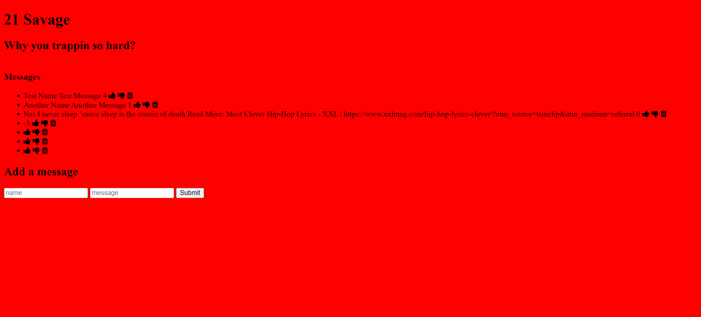

# 21 Savage Fan Site 💸🗡️💔

### Description
Welcome to the 21 Savage Fans platform, where you can share your thoughts and messages about 21 Savage and interact with other fans.

### How to Use
1. Scroll down to the "Add a message" section.
2. Enter your name and message in the respective input fields.
3. Click the "Submit" button to share your message with the 21 Savage community.

### Features
- **Dynamic Messages**: View and interact with messages from other users.
- **Thumbs Up/Down**: Show your approval or disapproval for a message by clicking on the corresponding thumbs-up or thumbs-down icon.
- **Message Sorting**: Messages are sorted based on the net count of thumbs up/down in descending order. The messages with the highest count will appear first, allowing users to discover the most popular content quickly.
- **Message Deletion**: Remove messages by clicking on the trash icon.

## Tech Used
- **Express.js**: A minimal and flexible Node.js web application framework.
- **MongoDB**: A NoSQL database for storing and retrieving messages.
- **EJS (Embedded JavaScript)**: A templating language for rendering dynamic content in HTML.
- **CSS**: Stylesheets for enhancing the visual appeal of the application.
- **JavaScript (main.js)**: Handles user interactions and communicates with the server.

## Lessons Learned
- **MongoDB Integration**: Connecting and interacting with MongoDB using Node.js.
- **Express Routing**: Defining routes to handle different functionalities.
- **EJS Templating**: Creating dynamic views for rendering messages.
- **Fetch API**: Communicating between the client-side and server-side for real-time updates.
- **Event Handling**: Managing user interactions using JavaScript.